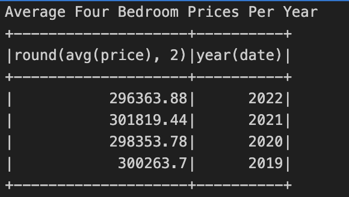
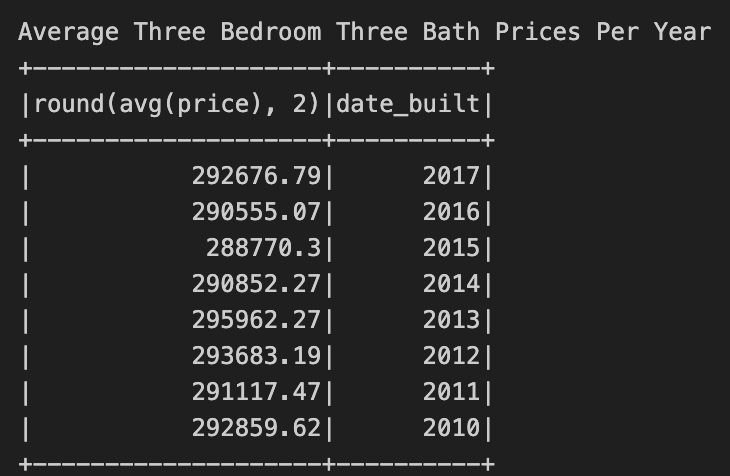
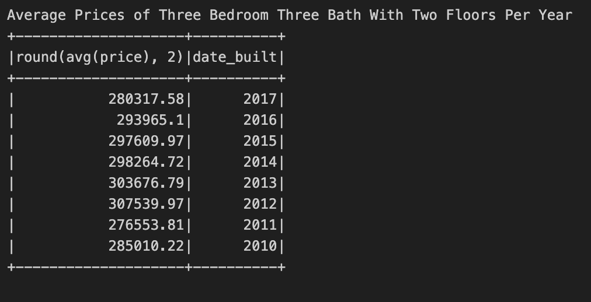
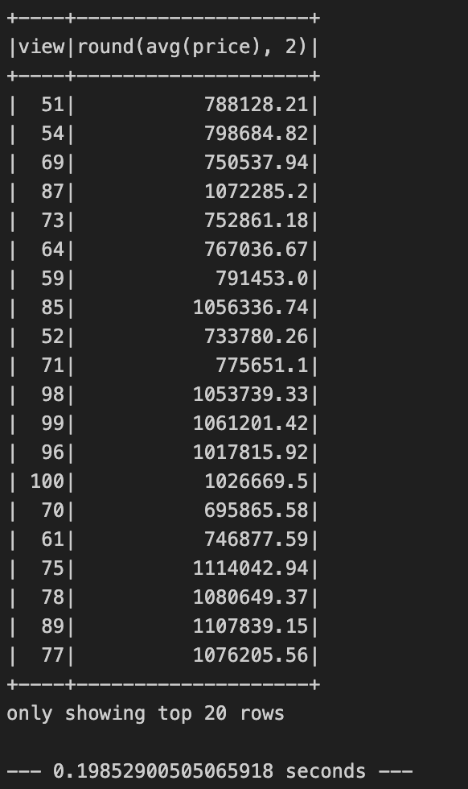

# Home_Sales
Module 22 Challenge: SparkSQL

For this challenge, I used my knowledge of SparkSQL to determine key metrics about home sales data. Then I used Spark to create temporary views, partition the data, cache and uncache a temporary table, and verify that the table has been uncached.

## Questions to answer:

1. What is the average price for a four-bedroom house sold for each year? Round off your answer to two decimal places.

2. What is the average price of a home for each year it was built that has three bedrooms and three bathrooms? Round off your answer to two decimal places.

3. What is the average price of a home for each year that has three bedrooms, three bathrooms, two floors, and is greater than or equal to 2,000 square feet? Round off your answer to two decimal places.

4. What is the "view" rating for homes costing more than or equal to $350,000? Determine the run time for this query, and round off your answer to two decimal places.

